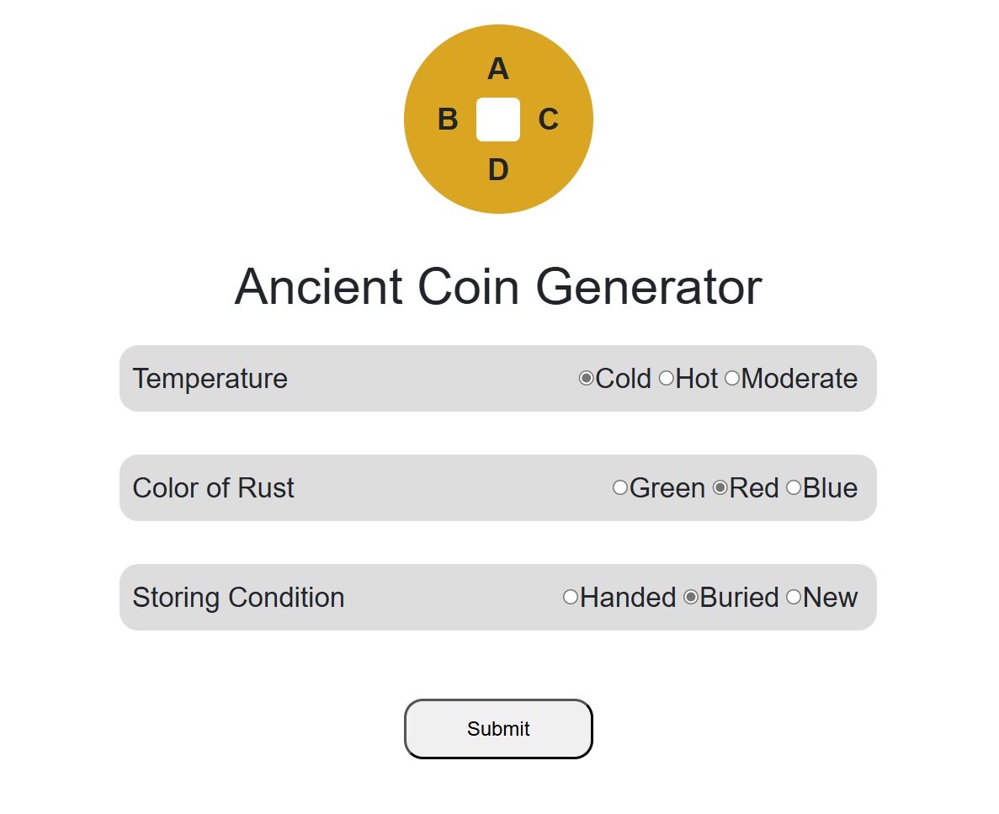
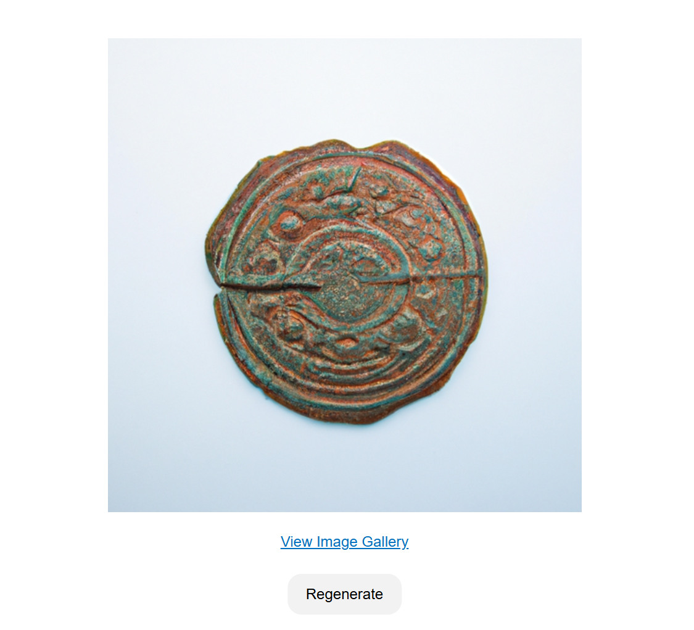
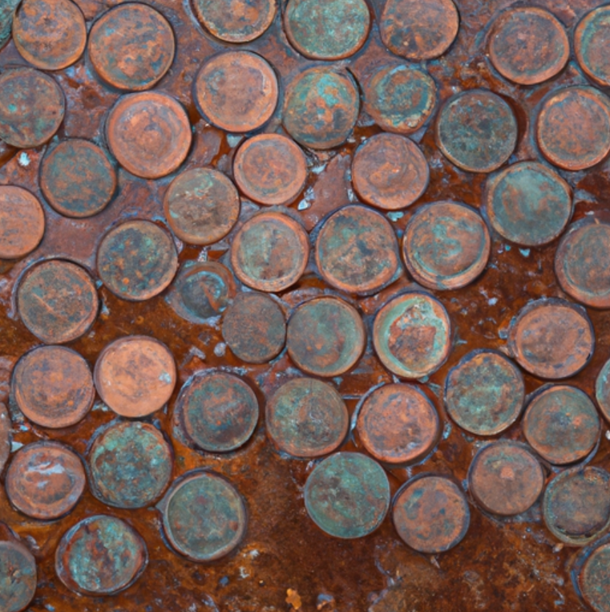
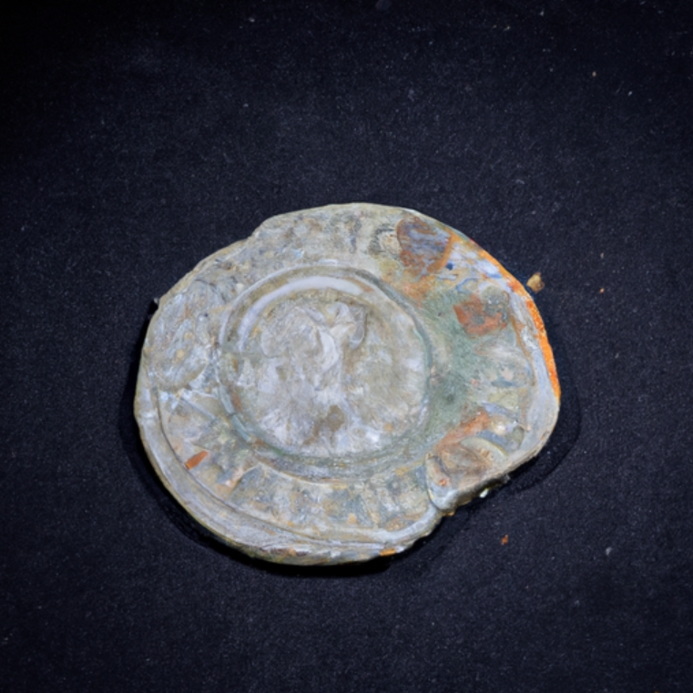
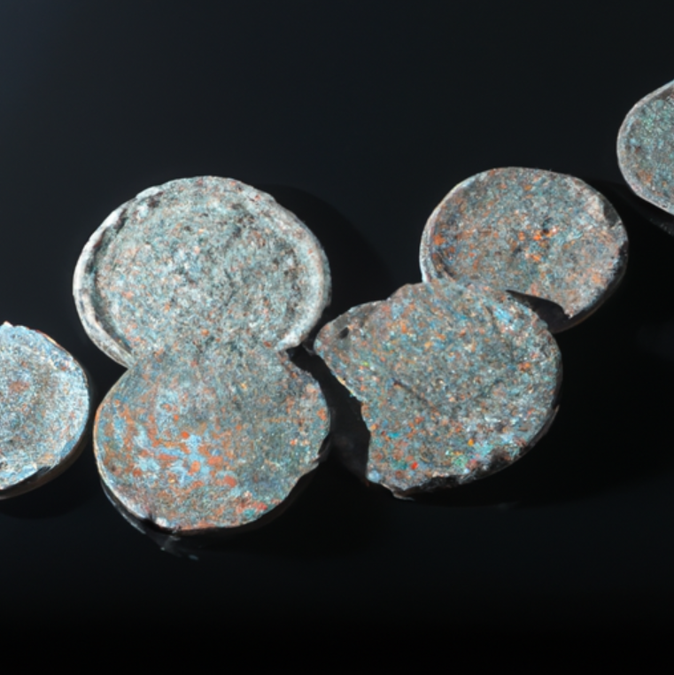
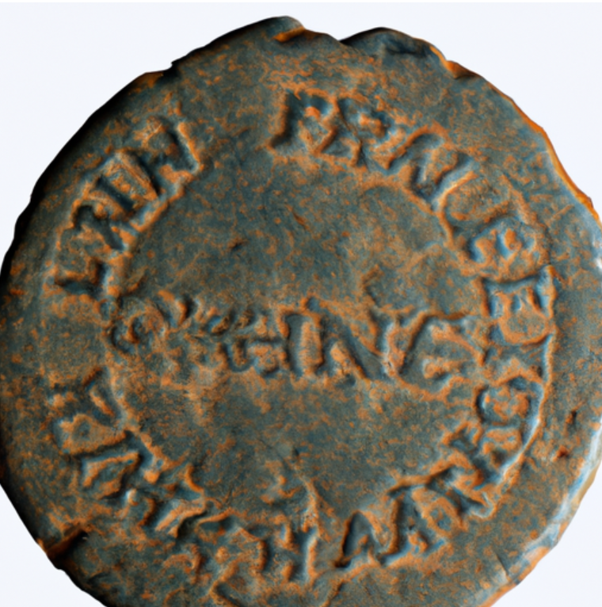

# Ancient Coin Generator

Welcome to the **Ancient Coin Generator** project! This tool allows users to create AI-generated images of ancient coins by selecting specific attributes through an intuitive interface. It also provides a gallery feature to view, share, and save generated images.

---

## Features

1. **AI-Generated Coins**: Generate ancient coin images based on selected combinations of temperature, rust color, and storing condition.

2. **Simple Button Interface**: Users can choose one button from three categories (Temperature, Rust Color, and Storing Condition) to define the coin's attributes.

3. **Image Regeneration**: Users can regenerate the coin image if they want to explore more variations.

4. **API Integration**: The system uses OpenAI's DALL.E API to generate realistic coin images based on the selected attributes.

---

## How It Works

1. **Select Attributes**: Choose one option from each of the following categories:
   - **Temperature**: Cold, Hot, Moderate
   - **Rust Color**: Green, Red, Blue
   - **Storing Condition**: Handed, Buried, New

2. **Generate Image**: Once the attributes are selected, click the "Submit" button. The system generates a prompt based on your selections and sends it to the DALL.E API.

3. **View Results**: The AI-generated coin image will appear. You can regenerate the image if desired.

4. **Save to Gallery**: Choose to save your image to the gallery to share with other users.

---

## Requirements

- A working internet connection
- API access to OpenAI's DALL.E (ensure you have the necessary API keys configured)
- Modern web browser

---

## Installation and Setup

1. Clone this repository:
   ```bash
   git clone https://github.com/yourusername/ancient-coin-generator.git
   ```

2. Navigate to the project directory:
   ```bash
   cd ancient-coin-generator
   ```

3. Install dependencies:
   ```bash
   npm install
   ```

4. Configure your OpenAI API Key:
   - Add your OpenAI API key to the `.env` file as:
     ```
     OPENAI_API_KEY=your_api_key
     ```

   > Note: Replace `your_api_key` with your actual OpenAI API key when using the application.

5. Run the application:
   ```bash
   npm start
   ```

6. Open your browser and navigate to `http://localhost:3000`.

---

## Screenshots

### User Interface


### Example Coin Image


### Additional Examples





---

## API Usage

The generator uses OpenAI's DALL.E API to create images. Here's how it works:

1. The selected options are translated into a detailed text prompt based on the three categories (Temperature, Rust Color, Storing Condition).
2. The system sends the prompt to the DALL.E API.
3. The API returns an AI-generated image based on the input prompt.

Example prompt for the API:
```
"An ancient coin found in moderate temperature conditions, with blue rust, stored in a buried condition."
```

---

## Future Enhancements

- Add more customization options, such as coin shape, size, and era.
- Integrate a rating system for gallery images.
- Implement user accounts for personalized galleries.

---

## Contributing

We welcome contributions! If you want to enhance the project, please:

1. Fork the repository.
2. Create a new branch for your feature:
   ```bash
   git checkout -b feature-name
   ```
3. Commit your changes:
   ```bash
   git commit -m "Add feature name"
   ```
4. Push your branch:
   ```bash
   git push origin feature-name
   ```
5. Create a Pull Request.

---

## License

This project is licensed under the MIT License. See the `LICENSE` file for details.

---

## Acknowledgments

- OpenAI for their powerful DALL.E API
- All contributors and users who make this project better!

Enjoy creating your own ancient coins and sharing them with the world!

